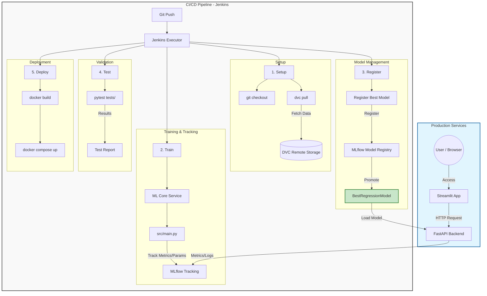

# 🚀 Sales Forecasting MLOps Project

A production-ready MLOps project for sales forecasting using **FastAPI**, **Streamlit**, **MLflow**, **DVC**, and **Jenkins**. This project demonstrates the full lifecycle of an ML application, from data versioning and model training to automated deployment and monitoring.

## 🏗️ Architecture

The project consists of several interconnected components:

*   **Frontend**: A Streamlit dashboard for visualizing data and making interactive predictions.
*   **Backend**: A FastAPI REST API that serves the best-performing model from MLflow.
*   **ML Core**: Training scripts that process data, train multiple models (XGBoost, CatBoost, LightGBM), and log experiments to MLflow.
*   **Tracking & Registry**: MLflow server backed by a Postgres database for experiment tracking and model management.
*   **Data Management**: DVC for versioning large datasets and storing them in remote storage.
*   **CI/CD**: Jenkins pipeline for automated testing, building Docker images, and deployment.

### � CI/CD Flow



## �🛠️ Tech Stack

*   **Frameworks**: FastAPI, Streamlit
*   **ML Libraries**: CatBoost, XGBoost, LightGBM, Scikit-learn, Pandas, NumPy
*   **DevOps**: Docker, Docker Compose, Jenkins
*   **MLOps**: DVC, MLflow
*   **Database**: Postgres (MLflow Metadata)
*   **Testing**: Pytest

## 🚀 Getting Started

### 1. Prerequisites

*   Docker & Docker Compose
*   DVC
*   Python 3.12+

### 2. Data Preparation

Pull the latest data version using DVC:

```bash
dvc pull
```

### 3. Local Deployment (Docker Compose)

Start all services (Postgres, MLflow, Backend, Frontend):

```bash
docker compose -f docker/docker-compose.yml up -d --build
```

The services will be available at:
*   **Frontend**: [http://<your_vm_ip>:8501](http://<your_vm_ip>:8501)
*   **Backend API**: [http://<your_vm_ip>:8000](http://<your_vm_ip>:8000)
*   **MLflow UI**: [http://<your_vm_ip>:5000](http://<your_vm_ip>:5000)

## 🧪 Model Training

To manually trigger a training run and log it to MLflow:

```bash
docker build -t ml_core -f docker/Dockerfile.ml_core .
docker run --network host ml_core
```

This script will:
1. Load the latest data from the `data/` directory.
2. Preprocess and split the data.
3. Train **LightGBM**, **CatBoost**, and **XGBoost** models.
4. Log metrics (RMSE, MAE, MSE, R2) and parameters to MLflow.
5. Register the best-performing model as `BestRegressionModel`.

## 🔄 CI/CD Pipeline

The project includes a `Jenkinsfile` that automates:
1. **Checkout**: Pulling the latest code.
2. **DVC Pull**: Fetching data.
3. **Unit Tests**: Running pytest (FastAPI & Streamlit tests).
4. **Build**: Creating Docker images for Backend and Frontend.
5. **Deployment**: Restarting containers with the new images.
6. **Health Checks**: Verifying service availability.

## 📁 Source Code Structure

```text
├── .dvc/               # DVC configuration
├── backend/            # FastAPI source code
├── frontend/           # Streamlit application
├── src/                # Core ML logic (train, evaluate, preprocess)
├── data/               # Versioned datasets
├── docker/             # Dockerfiles and Compose configs
├── jenkins/            # CI/CD Jenkinsfile
├── tests/              # Unit and integration tests
└── notebooks/          # Exploratory Data Analysis
```

## ✅ Testing

Run unit tests locally:

```bash
pytest
```
